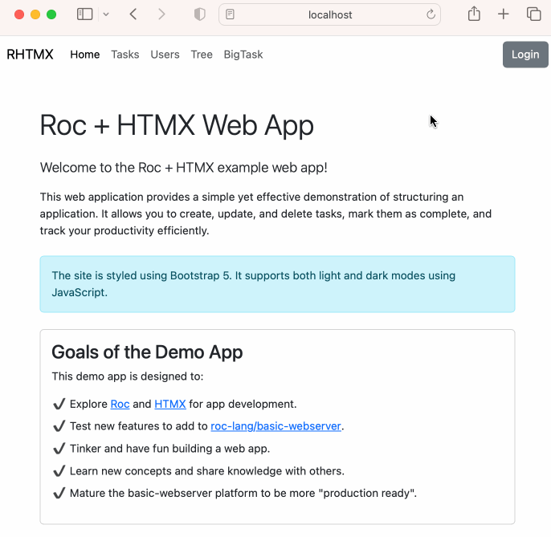

# roc + htmx playground

- Explore [roc](https://www.roc-lang.org) and [htmx](https://htmx.org) for app development
- Add new features to [roc-lang/basic-webserver](https://github.com/roc-lang/basic-webserver)
- Generally tinker and have fun

> **Note:** This project has been updated to use Roc alpha4 and basic-webserver 0.13.0

Any PR's or ideas welcome.

You are welcome to play with this and if you have something to share then please do.

## Getting Started

Ensure `sqlite3` and `roc` are on your `PATH`

**create test.db** `rm -rf test.db && sqlite3 test.db < test.sql`

**start server** `DB_PATH=test.db roc run --linker legacy src/main.roc`

**change port** Set `ROC_BASIC_WEBSERVER_PORT` to run on a different port, e.g. `DB_PATH=test.db ROC_BASIC_WEBSERVER_PORT=8080 roc run --linker legacy src/main.roc`

## Getting with Kingfisher

As an alternative to the basic-webserver, this playgroud can also be run with the [kingfisher platform](https://github.com/ostcar/kingfisher).

**start server** roc run src/kingfisher.roc -- --no-snapshot
