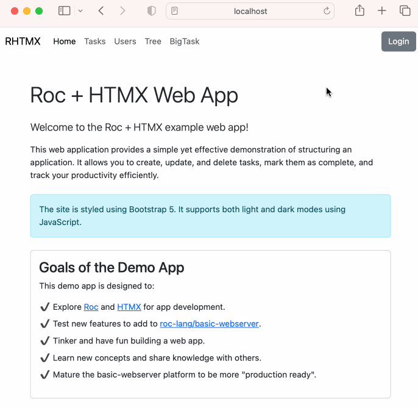

# roc + htmx playground

- Explore [roc](https://www.roc-lang.org) and [htmx](https://htmx.org) for app development
- Add new features to [roc-lang/basic-webserver](https://github.com/roc-lang/basic-webserver)
- Generally tinker and have fun

> **Note:** This project uses modern Roc syntax and
> [basic-webserver 0.14.0](https://github.com/roc-lang/basic-webserver/releases/tag/0.14.0).
> It vendors the
> [HTMX 4.0.0-beta6 browser build](https://github.com/bigskysoftware/htmx/releases/tag/v4.0.0-beta6)
> while HTMX 4 is in beta.

Any PR's or ideas welcome.

You are welcome to play with this and if you have something to share then please do.

## Getting Started

Ensure `sqlite3` and `roc` are on your `PATH`.

**format, validate, build, and serve the app** `roc scripts/tasks.roc dev`

**download the standalone Tailwind CLI and build CSS**
`roc scripts/tasks.roc css`

**create test.db** `rm -rf test.db && sqlite3 test.db < test.sql`

**start server** `DB_PATH=test.db roc src/main.roc`

**change port** Set `ROC_BASIC_WEBSERVER_PORT` to run on a different port, e.g.
`DB_PATH=test.db ROC_BASIC_WEBSERVER_PORT=8080 roc src/main.roc`

The server opens the SQLite connection pool once during `init!` and shares it
with request handlers through immutable application context.

The `dev` command manages `test.db` automatically and initializes it from
`test.sql` when it does not exist, so it needs no environment setup.

Run `roc scripts/tasks.roc css-watch` in another terminal while changing the
design system. Run `roc scripts/tasks.roc check` for the same CSS, formatting,
type-checking, and test validation used by CI.

The Roc task runner uses
[basic-cli 0.21.0](https://github.com/roc-lang/basic-cli/releases/tag/0.21.0)
to download and verify the pinned standalone Tailwind CLI under `.tools/`.
Tailwind utility strings live in `src/Design.roc`; views consume its typed,
semantic attributes instead of assembling class names directly. No npm or Make
installation is needed.

## Continuous integration

Pull requests run `roc scripts/tasks.roc check` to verify generated CSS,
formatting, type-checking, and tests.
