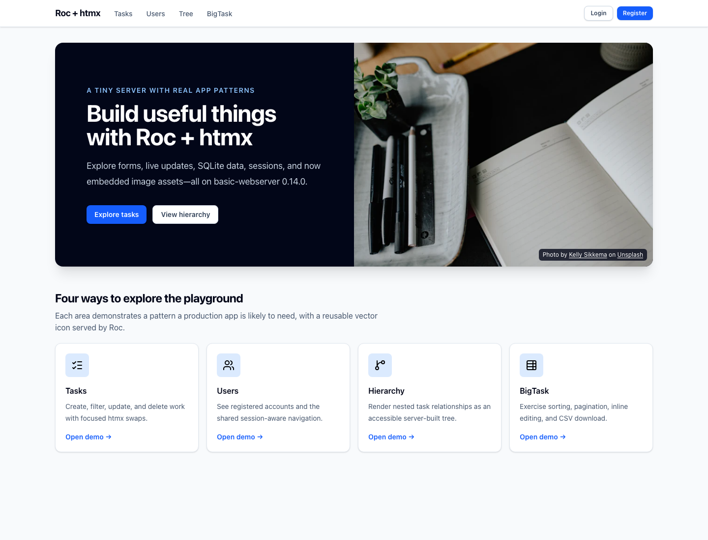

# Roc + htmx playground

A small server-rendered application for exploring how
[Roc](https://www.roc-lang.org), [htmx](https://htmx.org), and SQLite fit
together. It goes beyond a minimal example with typed routing, forms, sessions,
database adapters, static assets, and focused htmx interactions.



The playground includes:

- task creation, filtering, status updates, and deletion;
- registration, login, and shared session-aware navigation;
- a server-rendered task hierarchy;
- a sortable, paginated, editable data table with CSV export; and
- native static-file serving for responsive images and SVG icons.

The application uses modern Roc syntax,
[basic-webserver 0.14.0](https://github.com/roc-lang/basic-webserver/releases/tag/0.14.0),
and the vendored
[HTMX 4.0.0-beta6](https://github.com/bigskysoftware/htmx/releases/tag/v4.0.0-beta6)
browser build.

## Quick start

Install `roc` and `sqlite3`, then run:

```sh
sqlite3 test.db < test.sql
roc build --opt=speed src/main.roc
DB_PATH=test.db ./main
```

Open <http://127.0.0.1:8000>.

The optimized build is the recommended way to run the application. For a
shorter edit-and-run cycle, use:

```sh
DB_PATH=test.db roc run src/main.roc
```

Delete `test.db` before running the initialization command again if you want a
fresh copy of the sample data.

## Development

The repository includes a Roc task runner, so no npm or Make installation is
needed:

```sh
# Format, validate, build, and serve a development build
roc scripts/tasks.roc dev

# Run the same generated-CSS, formatting, type, unit, and integration checks as CI
roc scripts/tasks.roc check

# Rebuild CSS once, or continuously while editing the design system
roc scripts/tasks.roc css
roc scripts/tasks.roc css-watch
```

The task runner downloads and verifies the pinned standalone Tailwind CSS CLI
under `.tools/`. Tailwind utilities are centralized as semantic attributes in
`src/Design.roc`; views consume those attributes instead of assembling class
strings throughout the application.

## Architecture

The code is organized into typed feature slices:

- domain modules define validated values and use cases;
- handlers translate HTTP input into domain values and responses;
- stores isolate SQLite queries and storage conversion;
- views render typed models into HTML; and
- `src/main.roc` composes dependencies and dispatches typed routes.

See [architecture.md](architecture.md) for the design, alternatives considered,
and evidence gathered during the refactor.

The server opens one SQLite connection pool during initialization and shares it
with request handlers through immutable application context. It also mounts the
`assets/` directory through basic-webserver's native static-file support,
including MIME handling, file transfer, and public cache headers. Asset sources
and licenses are documented in [assets/README.md](assets/README.md).

For production deployment, put the application behind a reverse proxy such as
Caddy or nginx to add TLS and Brotli or gzip compression.

## Contributing

Pull requests and experiments are welcome. CI runs
`roc scripts/tasks.roc check` to verify generated CSS, formatting,
type-checking, unit tests, and SQLite integration tests.
