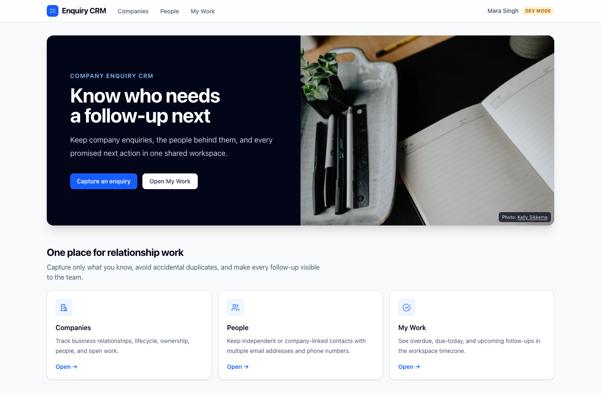

# Enquiry CRM

A small, self-hosted CRM for teams that need a dependable shared memory—not an
enterprise sales platform.

Enquiry CRM keeps companies, people, and next actions together so every enquiry
has context, an accountable owner, and a clear follow-up.



## Keep every enquiry moving

Enquiry CRM is designed for a single, trusted team that has outgrown
spreadsheets, personal notes, and remembering who promised to call whom. It
focuses on the relationship and the work that moves it forward:

- find and maintain shared company and contact records;
- review likely duplicates before creating another record;
- capture contact details without requiring unnecessary information;
- make overdue, due-today, and upcoming follow-ups visible;
- preserve activity and ownership context for the rest of the team; and
- optionally scan a business card to prefill a form for human review.

The product favours clear, reversible actions and lightweight workflows. AI can
assist with data entry, but it cannot silently create or change CRM records.

## Explore it locally

Install [Roc](https://www.roc-lang.org), SQLite, and Python 3, then run:

```sh
roc scripts/tasks.roc dev
```

Open <http://127.0.0.1:8000>. The development environment starts with
representative data and a local test identity.

See the [development guide](docs/development.md) for alternate identities,
database handling, builds, and verification commands.

## Project direction

The goal is a coherent minimal CRM for a small team: one place to understand
each relationship, see what has happened, and know what should happen next.
Opportunity management, portability, and later product capabilities are
developed against the [product roadmap](docs/roadmap/README.md).

## Documentation

- [Documentation overview](docs/README.md) — where architecture, requirements,
  risks, controls, and verification evidence live
- [Product roadmap](docs/roadmap/README.md) — target-state and proposed
  capabilities
- [Development guide](docs/development.md) — local development, testing, and
  builds
- [Production deployment](docs/deployment/digitalocean-tailscale.md) —
  supported private deployment and operations

## Technology

Enquiry CRM is built in [Roc](https://www.roc-lang.org) with SQLite and
server-rendered HTML, progressively enhanced with htmx.
